# Green Meals
## Introduction
This is project milestone 2: Interactive Front-End Development, for Code Institute's Full-stack development program.

Project Green Meals is a web-based recipe generator app which helps make it easier for users to try out/maintain a plant-based diet. The app randomly generates daily plant-based 3-meal plan based on user's preferences and restrictions. The meal plan includes calorie and nutrient breakdown in order to let users keep track of their intake, especially protein intakes for those who are starting out with plant-based diet. The app also allows user to create a grocery list based on the chosen meal plan for ease of organization.

## Showcase
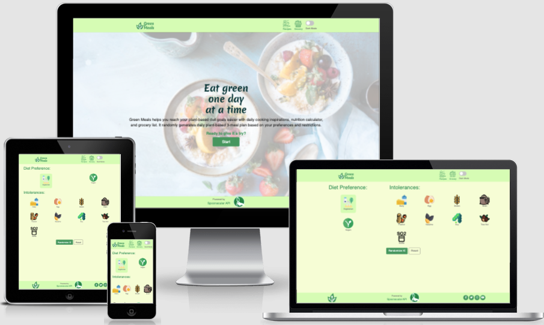*Mockup of project Green Meal on resonsive devices*

[Link to live project](thanh-cao.github.io/ms2-green-meals/)

## User Experience (UX)
### User Stories
* As a user:
  * I want to understand what the website is about and the purpose of it.
  * I want to be able to set my diet preference and intolerances so that I can see recipes suitable to my needs.
  * I want to see a single-day 3-meal plan suggestion generated based on my inputs.
  * I want to be able to get a new single-day 3-meal plan suggestion.
  * I want to be able to get a new suggestion for a specific meal in order to find the meal combination that I like.
  * I want to read the recipes more in details: ingredients needed and how to make it
  * I want to gather the ingredients of the dishes I have chosen into a list so that I can buy groceries based on it.
  * I want to see how much nutrients each single dish and a whole day 3-meal plan delivers.
  * I want to be able to choose light colored theme or dark colored theme so that I can read the screen easier.
* As a returning user:
  * I want to be able to continue where I left last visit.
    * I want to see the grocery list that I have created based on the the meals I chose in my last visit so that I can go buy the ingredients.
    * I want to see the recipes suggested to me in my last visit so that I can follow and make the dishes.
  * I want to be able to reset everything from last visit in order to get new recipe suggestions and new grocery list.

### Strategy
The idea behind Green Meals based on my own experience trying to follow a more plant-based diet. It was a time-consuming process trying to browse through many food blogs and got overwhelmed with too much information. Furthermore, I had to make sure I was consuming enough protein from plants in replacement of meat and a lot of food blogs don't include that information. Or it was a very manual process to go about keeping count of nutrients intake.

To flip the eating habits all the way and go plant-based is a intimidating process. Therefore, ***the goal of the app*** is to help make the transition a little less overwhelming by creating a meal plan with random recipes for inspirations with information on nutrient breakdown, instead of a long tedious list of suggestions. ***The goal of users*** is to find inspirations to make green meals and keep track of that they are consuming enough proteins from plants in replacement to meat protein.

### Scope
Based on the goals and the user stories discussed above, a list of requirements for both content and functionality was identified.
1. Content requirements:
* Introduction what the app is about.
* Instructions or cues, either visual or texts, on how to use the app.
* Recipe suggestion information should include: image of the dish, name, how much time in total it takes to create the dish, nutrient breakdown.
* Recipe details should include: image of the dish, name, duration it takes, how many servings, ingredients needed, intructions how to make the dish, nutrient breakdown. 
* Nutrient breakdowns for total 3-meal plan and for each single dish.
* Grocery list with checkbox for keeping track, ability to edit items and quantity, and delete items off the list.
  
2. Functionality requirements:
* Easy navigation to find the information that user needs
* Select diet preference and intolerances
* Fetch new random recipe for either the whole 3-meal plan or single meal
* View single recipe in details
* Add ingredients of chosen meal into grocery list
* Total nutrient intake of 3-meal plan automatically recalculated as user fetch for new suggestions
* Grocery list: 
  * Check box to cross an item off the list
  * Edit name and quantity of an item
  * Delete an item off the list
  * Reset the list
* Recipes and grocery list from last visit are stored locally to allow users to resume where they left
* Total reset both recipe suggestions and grocery list

### Structure
#### Information architecture
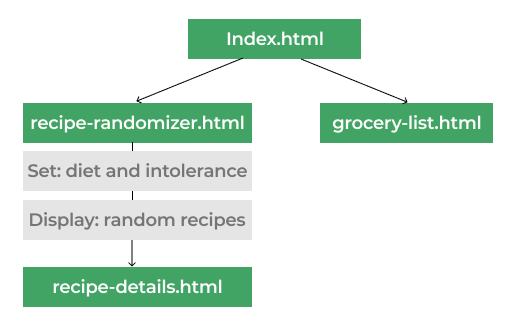
*Information Architecture*

As seen in the figure above, the architect of the app will remain simple with 2 main menus/pages: recipe suggestion page which further leads to recipe details page, and grocery list page. The app includes a header for navigation bar and footer which includes attribution to Spoonacular's API and Green Meals' social links.

#### Interaction flow
1. Scenario 1: first time user

The app begins with a start page index.html where they are introduced to what the app is about and a button cue to start the process, which will lead them to recipe-randomizer.html. In this page, there are 2 main actions expected:
* User **sets** their diet preference and intolerances and click "Randomize" button
* App **displays** random 3-meal plan based on user's selections

User can stay on this page to fetch new 3-meal plan suggestion for new one for single specific meal. As they click on a meal, they will go to that recipe's detailed page where user can learn more about the dish. As user reads the recipe's details and its ingredients, user can add the ingredients of that dish to grocery list page. A subtle visual cue will inform the user that the ingredients are added.

User can then go to grocery list page using the navigation header bar where they can see a compiled list of ingredient items added based on their chosen meals. Here, user has 4 actions they can do:

* Cross an item off the list with checkbox as they go buying groceries
* Edit name and/or quantity of an item
* Delete an item from the list
* Reset grocery list to empty

1. Scenario 2: returning user

* Case 1: user has data from their previous visit for recipes suggestion or grocery list. In this case, upon entering the app, user will be greeted with a modal asking if (1) they want to continue where they left or (2) reset everything. If user chooses (1), they will be taken to recipe suggestion list. If user chooses (2), recipe suggestions and grocery list will be reset, and user will be taken to the start page index.hthm.
* Case 2: user has empty data, then user will land on the page accordingly to the URL.

### Skeleton
#### Design
* Color scheme:
  * Since the app focuses on plant-based diet, I decide to use green and shades of green as color scheme for the app. I want to create color schemes for light theme and dark theme so I started off with choosing the main green shade for the logo (with hex #41A464) and then background shades for light (hex #F6FFD7) and dark theme (hex #003B3C) that could work well with the logo's shade. From there, I generate other shades and colors for both themes as can be seen below.

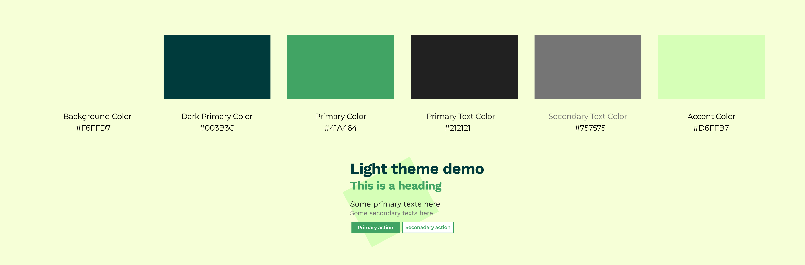*Light theme colors*

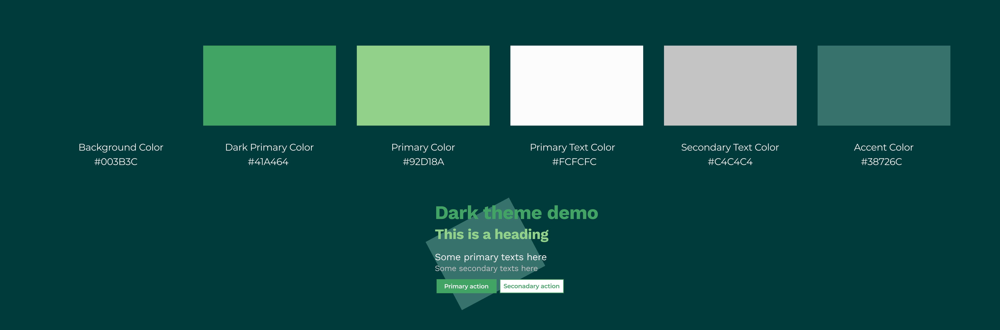*Dark theme colors*

* Logo:
  * I came up with logo idea and designed using Adobe Illustrator by adapting cutlery icons from [Flaticon](https://www.flaticon.com/), leaf icon from [Freepik](https://www.freepik.com/), and text in Merienda font.
  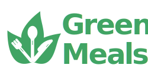*Green Meals logo*

* Typography:
  * The font being used for logo and the hero title on the front page is Merienda. Other than that, the main font being used throughout the website is Montserrat since the font offers ease of readability in order to follow text-heavy recipes. The fallback font is Sans Serif in case of failure loading the main font.
* Imagery:
  * The background images on index.html and grocery.html are taken from Unsplash. Other than that, images for recipes and ingredients are fetched from Spoonacular's food API.
  * Icons are taken from 

#### Wireframes
* Wireframe for mobile - light theme: [View](readme/wireframe-mobile-light.png)
* Wireframe for mobile - dark theme: [View](readme/wireframe-mobile-dark.png)
* Wireframe for tablet: [View](readme/wireframe-tablet.png)
* Wireframe for desktop: [View](readme/wireframe-desktop.png)

#### Design changes
* Some colors are adjusted during production in order to better increase constrast and readability, especially for dark mode theme.
* Reset button is added on recipe-randomizer.html for better user experience: giving user the possibility to clear the previous data to start fresh.
* Add to grocery list button was intended to let user add the entire ingredient list to grocery list as a whole. However, this makes a bad user experience as a lot of ingredients are repetitive from one recipe to another, and some are very trivial like salt or sugar. Therefore, I adjusted to let user add single item instead for better control.

## Features
### Existing features 

#### Navigation bar available throughout all pages
Navigation bar features Green Meals' logo on the left side which links to index.html. On the right side is icons and text in order to inform the user the pages they would be led to. There is also a switch which allows user to toggle on/off dark mode based on their preference.

#### Footer available throughout all pages
Footer includes Green Meals' logo icon, social links, and attribution to [Spoonacular Food API](https://spoonacular.com/food-api). Social links and link to Spoonacular API open in a new tab for ease of navigation.

#### Landing page (index.html)
Upon landing Green Meal's start page, user is introduced to what the application is about and a button to inform user what to do on this page. Background features an attractive image of a decorative fruit and cereal bowl to establish the theme and feel of the site and an impression that plant-based diet can be fun and delicious.
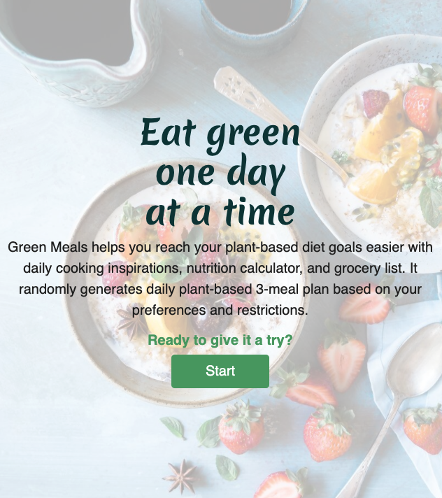

#### Recipe randomizer page (recipe-randomizer.html)
Upon this page, user is presented first with a panel of options allowing user to set their diet preference and intolerances. By default, Vegetarian is chosen as diet in order to give the visual cue that user can select their preferences. If vegan is selected, Dairy and Egg are also selected visually by default to ensure user that there is no dairy and egg included in the their vegan preference. Two buttons available to let user fetch meal plan suggestion or to reset their settings.
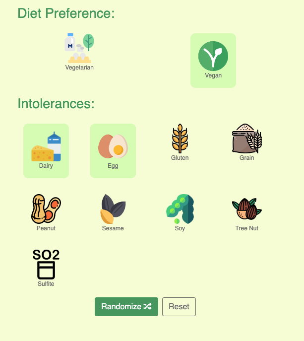

Once user clicks 'Randomize' button, the page reveals the meal plan sugggestion section showing breakfast, lunch, dinner with their details as well as buttons to inform user that they can click on the button to fetch a new recipe. When clicking on each of the meal card, user is taken to recipe details page of that selected meal.
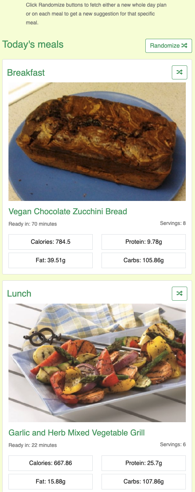

Caloric breakdown section is also shown to let user know how much calories/ protein/ fat/ carbs they would consume in total from the suggested meal plan as well as a pie chart showing caloric percentage breakdown of each nutrient. If user chooses to fetch new suggestion for the meal plan, or for any of the single meal, the percentage breakdown as well as the absolute data will be recalculated accordingly.
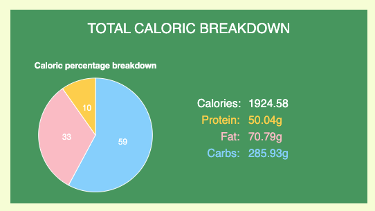

#### Recipe details page (recipe-details.html)
This page includes the neccessary information in order to make the meal: image of how the meal can look like, ingredients needed, time to make the dish, number of servings, instructions, nutrient information for this dish. User can select which ingredient they want to add to their grocery list by clicking the green plus button. To remove, simply click the red minus button.
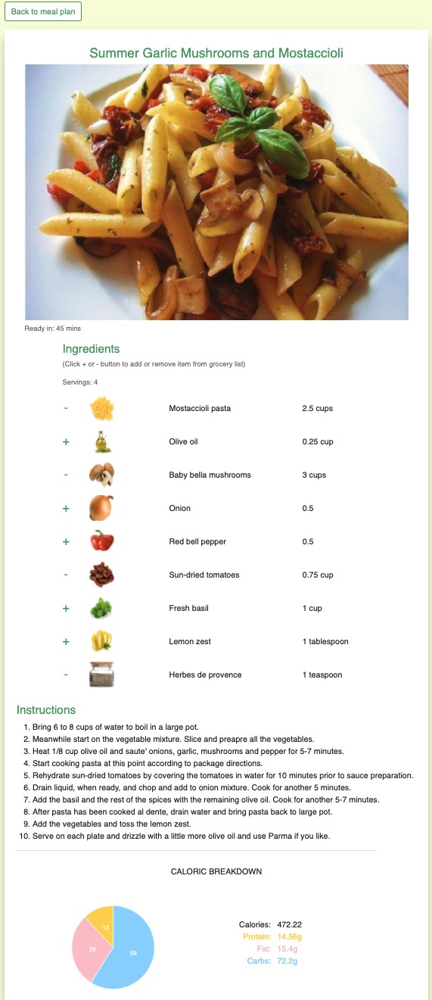

#### Grocery page (grocery.html)
An image showing neon light 'Grocery' is shown to indicate where user is on the page. If user hasn't had any item added to grocery list, an image of a shopping cart and text will inform so. If there are items on grocery list, a list is automatically populated upon landing. Here, user can check the check box to strike items to keep track while shopping, edit item's name and/or quantity, and delete an item off the list.
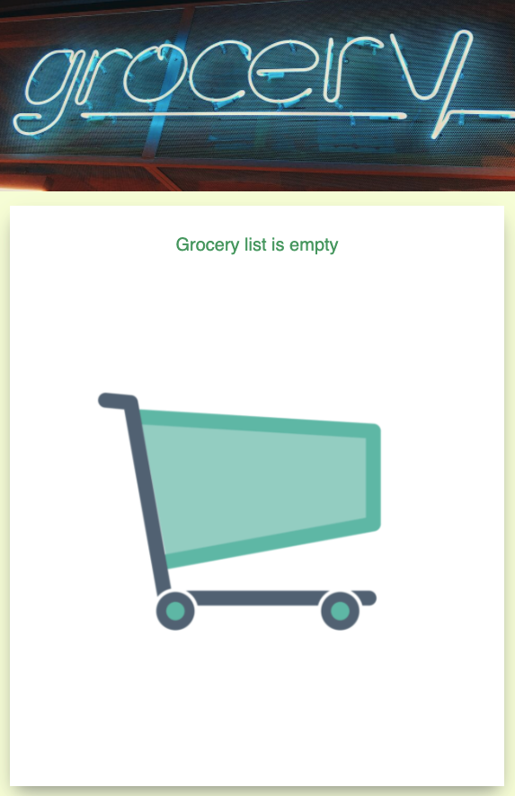 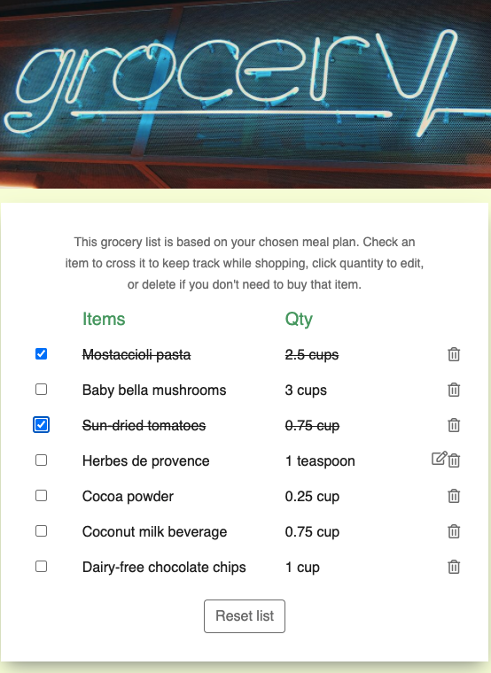

### Future implementations
There are endless possibilities that can be implemented in the future. To name a few that can go in the pipeline for next release:
* More options to choose to set meal preference: min max calories/carbs/fat/protein a day, exclude specific ingredients due to allergy, maximum time in minutes to make a meal, type of cuisine, etc.
* Option to generate meal plan for a whole week and then month.
* Save favorite recipes
* Wine paring
* etc...