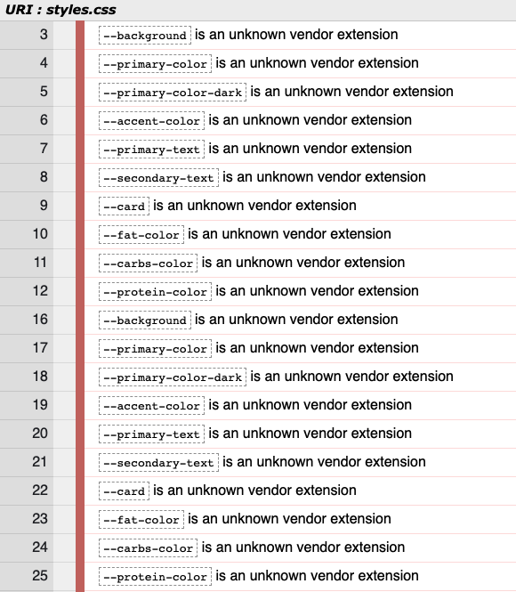
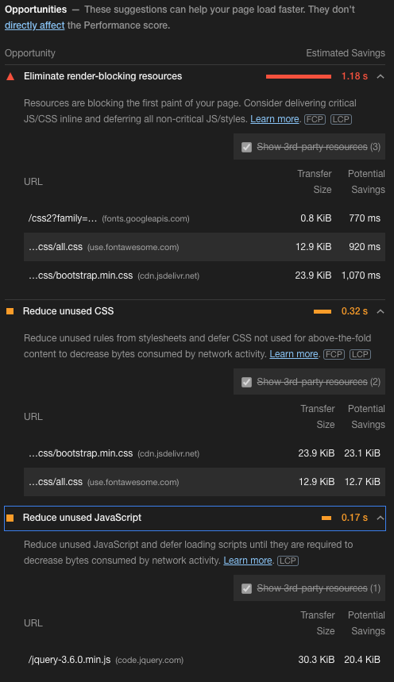

# Green Meals - Testing
## During development
During the development process, Chrome DevTools was employed greatly in order to debug and adjust layout responsively on multiple devices. Console tab was used intensively in order to debug and test functions and logic. Furthermore, various browsers (Google Chrome, Firefox, Safari, Internet Explorer) and physical devices (13-inch screen, 27-inch screen, iPhone X, Samsung Galaxy S9, iPad) were used to view the website in order to check the responsiveness.

## Validators and tools
### W3C Markup Validator
All markups of the application across pages were ran through the [W3C Markup Validator](https://validator.w3.org/nu/). There were only minor errors such as typo mistakes, missing alt attribute on image, or missing `"` sign. They were all fixed accordingly to show no errors afterwards.

### W3C CSS Validator
[W3C CSS Validator](https://jigsaw.w3.org/css-validator/) was utilized and the results show no errors. There are warnings that all the CSS variables that are declared in order to set color scheme for light/dark mode are unknown vendor extension. Since these are not relevant warnings, I decided to ignore them.

### Lighthouse audit
Chrome DevTool's Lighthouse was used to audit the overall performance of the application. After adjusting all the codes following the suggestions from the evaluation, the final results are as in below:

All measures returned satisfactory, except for Performance which fell a bit short at 82 points. Looking at the suggested opportunities which could help optimize the performance, I decided to not act upon them because Lighthouse suggest to eliminate or reduce unused CSS or JavaScript, all of which are core libraries I use to build the website, and therefore cannot be eliminated.

### JSHint
All JavaScript codes were parsed into [JSHint](https://jshint.com/) in order to check the quality and syntax use of code base. The report shows 2 undefined variables `ChartDataLabels` and `Chart`, both of which are variables from third-party library and plugin for chart.js and therefore can be ignored. Report also shows 2 unused variables `resumePreviousSession` and `findNewMeal`, both of which are function variables being embedded with the html buttons element and therefore can be ignored.
