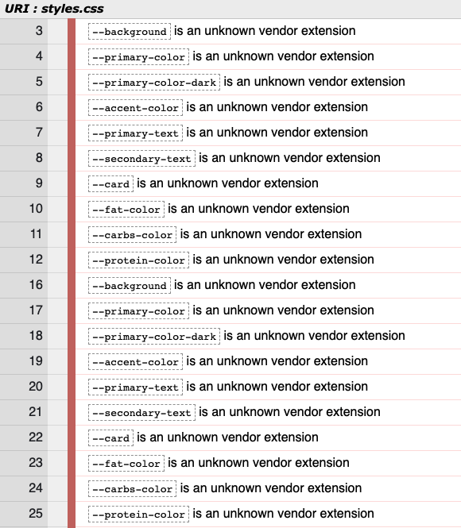

# Green Meals - Testing
## During development
During the development process, Chrome DevTools was employed greatly in order to debug and adjust layout responsively on multiple devices. Console tab was used intensively in order to debug and test functions and logic. Furthermore, various browsers (Google Chrome, Firefox, Safari, Internet Explorer) and physical devices (13-inch screen, 27-inch screen, iPhone X, Samsung Galaxy S9, iPad) were used to view the website in order to check the responsiveness.

## Validators and tools
### W3C Markup Validator
All markups of the application across pages were ran through the [W3C Markup Validator](https://validator.w3.org/nu/). There were only minor errors such as typo mistakes, missing alt attribute on image, missing `"` sign. They were all fixed accordingly to show no errors afterwards.

### W3C CSS Validator
[W3C CSS Validator](https://jigsaw.w3.org/css-validator/) was utilized and the results show no errors. There are warnings that all the CSS variables that are declared in order to set color scheme for light/dark mode are unknown vendor extension. Since these are not relevant warnings, I decided to ignore them.

