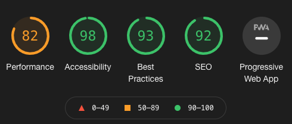
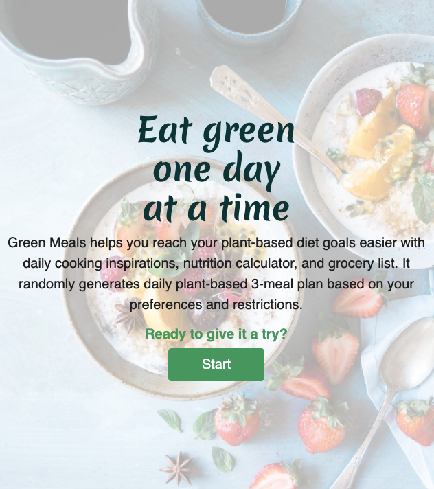
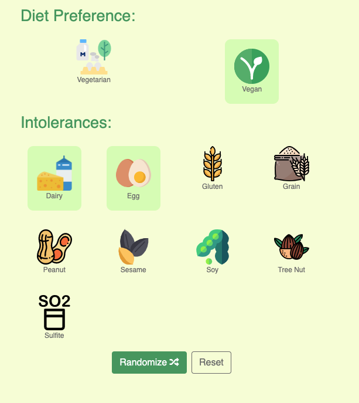
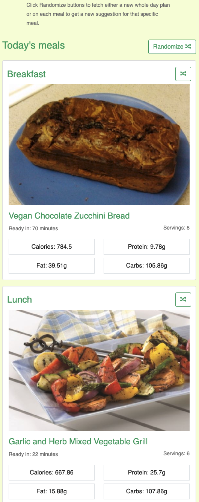
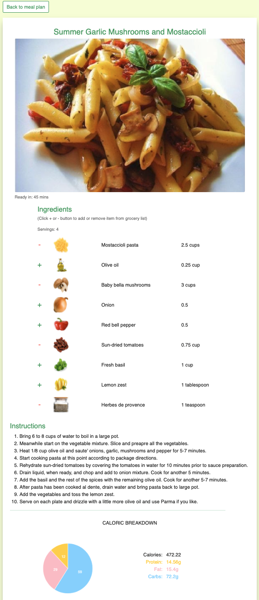
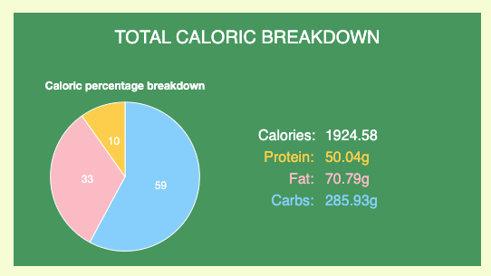

# Green Meals - Testing
## During development
During the development process, Chrome DevTools was employed greatly in order to debug and adjust layout responsively on multiple devices. Console tab was used intensively in order to debug and test functions and logic. Furthermore, various browsers (Google Chrome, Firefox, Safari, Internet Explorer) and physical devices (13-inch screen, 27-inch screen, iPhone X, Samsung Galaxy S9, iPad) were used to view the website in order to check the responsiveness.

## Validators and tools
### W3C Markup Validator
All markups of the application across pages were ran through the [W3C Markup Validator](https://validator.w3.org/nu/). There were only minor errors such as typo mistakes, missing alt attribute on image, or missing `"` sign. They were all fixed accordingly to show no errors afterwards.

### W3C CSS Validator
[W3C CSS Validator](https://jigsaw.w3.org/css-validator/) was utilized and the results show no errors. There are warnings that all the CSS variables that are declared in order to set color scheme for light/dark mode are unknown vendor extension. Since these are not relevant warnings, I decided to ignore them.

### Lighthouse audit
Chrome DevTool's Lighthouse was used to audit the overall performance of the application. After adjusting all the codes following the suggestions from the evaluation, the final results are as in below:

All measures returned satisfactory, except for Performance which fell a bit short at 82 points. Looking at the suggested opportunities which could help optimize the performance, I decided to not act upon them because Lighthouse suggest to eliminate or reduce unused CSS or JavaScript, all of which are core libraries I use to build the website, and therefore cannot be eliminated.

### JSHint
All JavaScript codes were parsed into [JSHint](https://jshint.com/) in order to check the quality and syntax use of code base. The report shows 2 undefined variables `ChartDataLabels` and `Chart`, both of which are variables from third-party library and plugin for chart.js and therefore can be ignored. Report also shows 2 unused variables `resumePreviousSession` and `findNewMeal`, both of which are function variables being embedded with the html buttons element and therefore can be ignored.

## User stories testing
1. As a user, I want to understand what the website is about and the purpose of it.
* When users enter landing page, they will see right away the logo and name of the project which implying the purpose of the application concerns food and diet. The icons and texts on navigation bar showing `Recipe` and `Grocery` also help in give context.
* The theme and purpose of the website is further enhanced by the hero text giving context and intention of the application. Background image shows an attractive and decorative fruit and cereal bowl to establish the theme and feel of the site and an impression that plant-based diet can be fun and delicious. The 'Start' button helps user to navigate to the next step.
  

2. As a user, I want to be able to set my diet preference and intolerances so that I can see recipes suitable to my needs.
* Upon landing recipe-randomizer.html, users are introduced to a panel of icons clearly marked with `Diet Preference` and `Intolerances` with descriptive icons and text to inform users that they can set their diet preferences and intolerances.

3. As a user, I want to see a single-day 3-meal plan suggestion generated based on my inputs.
* Once users have set their diet preference and intolerances and click "Randomize" button, they will immediately see a meal plan including breakfast, lunch, dinner being generated for them. The meal plan is generated based on users' preferences.

4. As a user, I want to be able to get a new suggestion for a specific meal in order to find the meal combination that I like.
* The meal plan includes 3 meals a day: breakfast, lunch, and dinner. Each meal cards has a "Randomize" button on top right, inside the borders of the meal card to visually imply that this button is applicable for that specific meal card. 
* By clicking the button, users will get a new suggestion for that specific meal.

5. As a user, I want to read the recipes more in details: ingredients needed and how to make it.
* When users click a meal card, they will be able to read the details of the chosen recipe: name of the dish, image of how the dish could look like, how long it takes to make, number of servings, ingredients needed, instructions how to make, and nutrients breakdown of that dish.

6. As a user, I want to gather the ingredients of the dishes I have chosen into a list so that I can buy groceries based on it.
* When reading the recipe's details, users can add the ingredient items to grocery list and/or remove items from the list.
* The actions add/remove are guided by a small text as well as green `+` sign or red `-` sign.

7. As a user, I want to see how much nutrients each single dish and a whole day 3-meal plan delivers.
* The caloric breakdown section is shown at recipe-randomizer.html page to show data for 3-meal plan and at recipe-details.html page to show data for that specific meal. This section is displayed either at the bottom of the page or on the side responsively to the devices being used to view on.
* When users are at recipe-randomizer.html page, the data of nutrients breakdown automatically recalculate whenever they click button to fetch a new meal plan or a new single meal.
* This nutrients breakdown section shows 2 things: absolute data of nutrients (calories, fat, carbs, protein) as well as a pie chart showing percentage of how much each nutrient accounts for the total calories.

*Nutrient breakdown section for mealplan*

*Nutrient breakdown section for single meal*

8. As a user, I want to be able to choose light colored theme or dark colored theme so that I can read the screen easier.
* The light/dark theme switch is positioned on the right of the navigation bar and is available across the pages so that users can easily switch theme whenever they want.

9. As a returning user, I want to be able to continue where I left last visit.
* When users return to the page and if they have already had a meal plan generated from previous visit, they are greeted with a modal asking if they want to resume previous session or if they want to reset data. 

10. As a returning user, I want to see the recipes suggested to me in my last visit so that I can follow and make the dishes.
* If users choose to *resume* when they see the modal, they will either be led to recipe-randomizer.html page or remain at grocery.html to continue where they left off.
  
11. As a returning user, I want to see the grocery list that I have created based on the the meals I chose in my last visit so that I can go buy the ingredients.
* If users choose to *resume* previous session and if they have added items to grocery list, they will be able to see the list populated when they access grocery.html. Any changes they made to the list: edit name/quantity, remove, will remain as saved.

12. As a returning user, I want to be able to reset everything from last visit in order to get new recipe suggestions and new grocery list.
* The modal for returning users has a "*Reset*" button which will reset all data from previous visit so that users can start from the beginning with empty meal plan and grocery list.

## Further testing
A lot of testing was done intensively during development to ensure that everything functions the way they should be and feedback is given to users at each interaction.
* Navigation bar: all the links go to the correct location with indicator to inform users where they are on the application.
* Light mode / dark mode: is toggled accordingly. The chosen theme mode is applied throughout all the pages as well as when users reload the page or return to the page.
* Responsiveness on different devices: application was thoroughly reviewed on different physical devices as well as Chrome DevTool.
* Diet preference and intolerance selection panel: a visual cue is shown when an icon is selected to inform users of their selection. By default, if Vegan is chosen as diet preference, Dairy and Egg are chosen as intoleraces and cannot be deselected upon vegan option to ensure users that vegan preference doesn't include the said ingredients.
* Randomize buttons: buttons have hover effects to inform users which button is being clicked. When buttons are clicked, users should immediately see new meal plan or new single meal being displayed.
* Reset button: reset all saved data in localStorage as well as clear data being displayed on screen.
* Nutrient breakdown section for meal plan: should update automatically as users fetch for new meals.
* Add/Remove ingredient item to grocery list:
  * When users click the green `+` button, it should change to red `-` button and vice versa. This is to inform users that the selected item has been added or removed from grocery list.
  * When users reload recipe details page, the ingredient items that have been added to grocery list should show red `-` button to indicate that items have already been added and users can choose to remove them from the list.
* Grocery list:
  * Checkbox: upon checked, the selected item's name and quantity will be striked through.
  * Edit item's name and quantity: by tapping the fields, users should be able to edit the name and quantity. These information should be saved on localStorage for later use.
  * Remove: item is removed from the list completely.
  * Reset button: clear the grocery list and show empty list message.